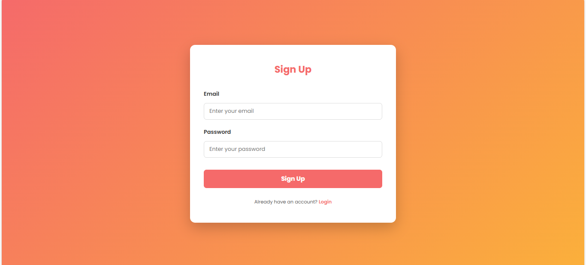
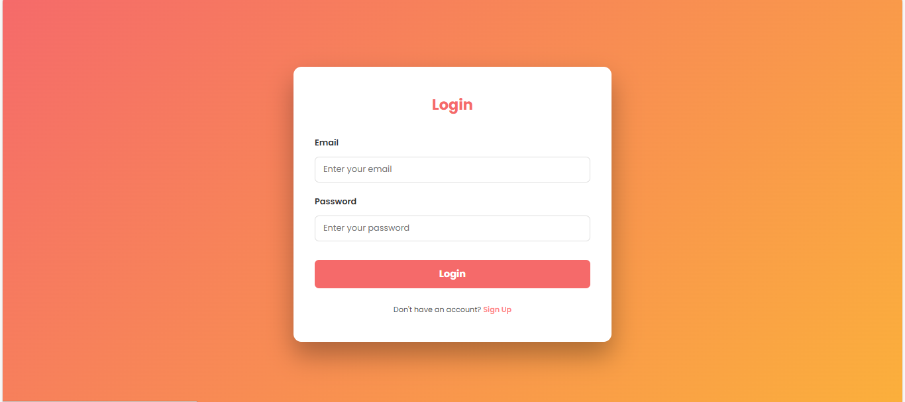

# Firebase Authentication UI Project

A modern **Sign Up & Login page** built with **HTML, CSS, JavaScript**, and **Firebase Authentication**.  
This project demonstrates **secure user authentication**, **interactive UI**, and **responsive design**, complete with **SweetAlert2 notifications** for a smooth user experience.

---

## Table of Contents
- [Features](#features)  
- [Technologies Used](#technologies-used)  
- [Project Screenshots](#project-screenshots)  
- [Setup & Installation](#setup--installation)  
- [Usage](#usage)  
- [Live Demo](#live-demo)  
- [Author](#author)  

---

## Features
- **User Authentication:** Sign up and login using **email and password** via Firebase.  
- **Interactive Alerts:** Beautiful popups with **SweetAlert2** for success, error, and warning messages.  
- **Google-style Responsive UI:** Fully responsive layout for desktop and mobile devices.  
- **Login Redirect:** Option to navigate to portfolio after successful login.  
- **Toggle Forms:** Seamless switch between Sign Up and Login forms.  

---

## Technologies Used
- **Frontend:** HTML5, CSS3, JavaScript (ES6+)  
- **Backend / Cloud:** Firebase Authentication  
- **Libraries & Tools:** SweetAlert2, Google Fonts  
- **Deployment:** Netlify / Firebase Hosting  

---

## Project Screenshots
### Sign Up Form


### Login Form


### Success Alert Example


---

## Setup & Installation

1. Clone this repository:
   ```bash
   git clone https://github.com/Waqar5/firebase-auth-ui.git
Open the project folder in your code editor.

Add your Firebase configuration in app.js:

javascript
Copy code
const firebaseConfig = {
    apiKey: "YOUR_API_KEY",
    authDomain: "YOUR_PROJECT_ID.firebaseapp.com",
    projectId: "YOUR_PROJECT_ID",
    storageBucket: "YOUR_PROJECT_ID.appspot.com",
    messagingSenderId: "YOUR_SENDER_ID",
    appId: "YOUR_APP_ID"
};
Install dependencies if needed (for Firebase SDK via npm) or use CDN in your HTML.

Open index.html in a browser or deploy on Netlify for live usage.

Usage
Open the project in a browser.

Navigate between Sign Up and Login forms.

Sign up with a valid email and password.

Login with registered credentials.

Upon successful login, a SweetAlert2 popup appears with:

Option to Go to Portfolio

Option to Stay on Login Page

Error handling included for invalid credentials or empty input fields.

[Live Demo](https://bespoke-bonbon-9a6563.netlify.app/)

